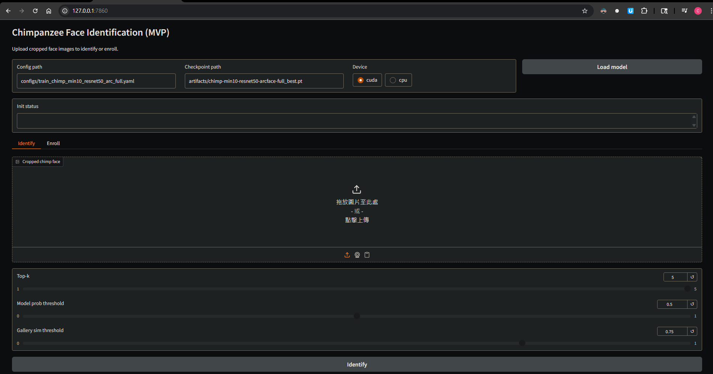
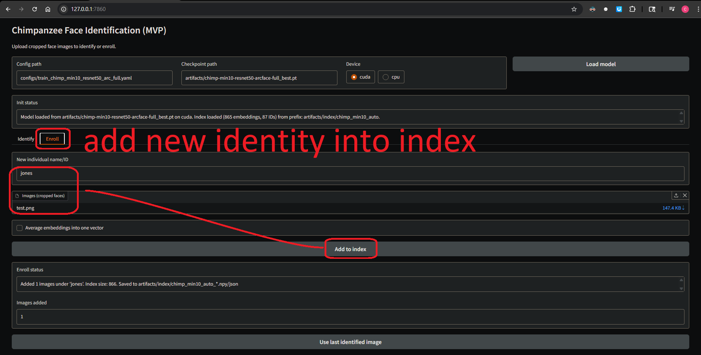
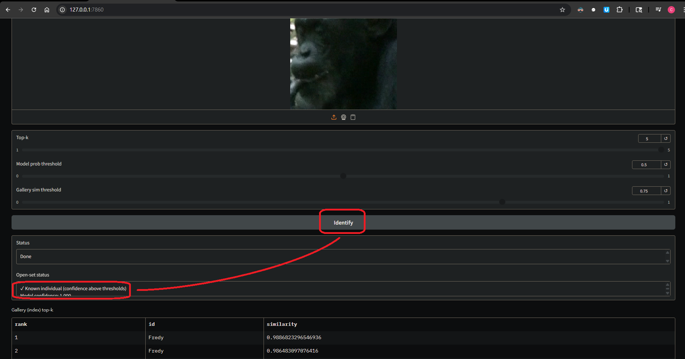
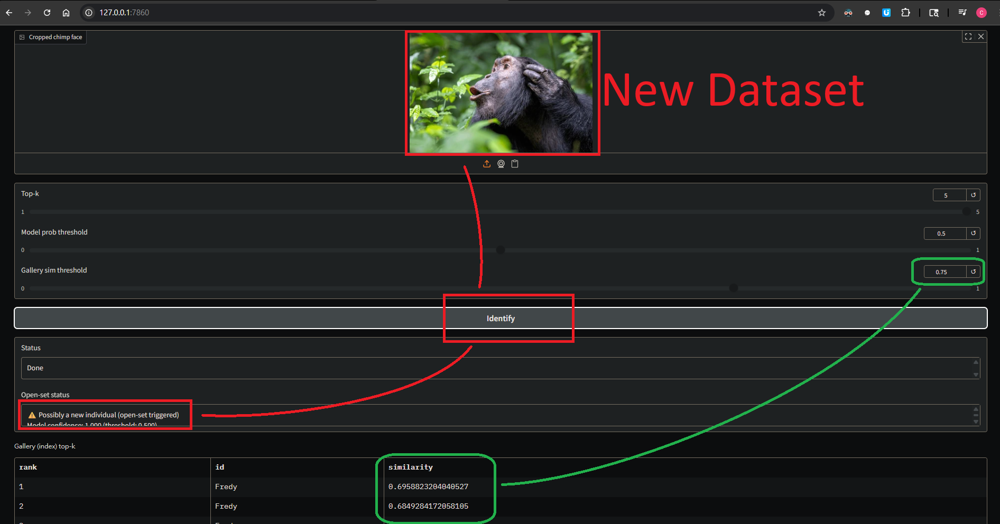

# Macaque Face Identification

This repository contains a PyTorch pipeline for **macaque face identification** — closed-set recognition of known individuals, with components that also support open-set hinting and enrollment workflows.

Faces are detected and cropped upstream (YOLO; see the `yolo_detection/` part of the wider project), split per-individual into train/val/test, and this repo trains/evaluates a **ResNet50 + ArcFace** model on those crops and serves a GUI for identification.

> Note: the codebase is dataset-agnostic at its core (a generic `AnimalFaceDataset` also exists), but the active pipeline and the trained model target macaques.

## GUI Overview

A quick visual guide to the GUI application (`tools/macaque_gui_app.py`).

### 1. Initial View
The initial interface before loading a model. It shows the configuration path, checkpoint path, device selector (CUDA/CPU), and the empty "Identify" tab with its drag-and-drop upload area.



### 2. Enroll a New Individual
The "Enroll" workflow lets a user add a new individual to the recognition index: provide a name/ID, upload one or more cropped face images, and click "Add to index." The index updates and saves automatically.



### 3. Identify a Known Individual
A result for a known individual. Both the model's confidence and the gallery similarity score exceed their thresholds, so the system returns "Known individual" and lists the top matching candidates.



### 4. Identify an Unknown Individual (Open-Set)
A result for a new/unknown individual. The model's classification confidence may be high, but similarity to the closest gallery face is below the threshold (e.g. < 0.75), triggering the open-set logic: "Possibly a new individual."



## Features

- **End-to-End Workflow**: training, evaluation, inference, and a GUI.
- **Configuration-Driven**: experiments controlled via simple YAML config files.
- **ResNet + ArcFace**: ResNet50 backbone with an ArcFace head, a standard for face recognition.
- **Reproducibility**: fixed seeds and explicit split manifests.

---

## Project Status: Trained Macaque Model

- **Model:** `ResNet50` backbone with an `ArcFace` head.
- **Best checkpoint:** `artifacts/macaque-resnet50-arcface_aug2_best.pt`.
- **Test performance (held-out test split, corrected no-margin eval):** Top-1 ≈ **0.83**, Macro-F1 ≈ **0.82**.

> Evaluation note: ArcFace is scored at test time **without** the angular margin (the margin is a training-only device). See `src/training/evaluate.py` (`ArcFaceHead.logits_eval`).

## Dataset

- **156 individuals**, **6607** train / **1361** val / **1584** test face crops.
- Crops are produced upstream by YOLO detection, then split per-individual (70/15/15) — see `gorillavision/reid-system/scripts/prepare_macaque_dataset.py` in the wider project.
- This repo consumes:
  - the crops under `…/yolo_detection/.../macaque_crops/{train,val,test}/<ID>/`, and
  - the split manifest `data/macaque_faces/splits.json` (each entry `{"id", "path"}`).
- Imbalance is mild (Gini ≈ 0.29; median ≈ 40 images/ID).

---

## Conceptual Overview

For an explanation of the architecture and common questions, see:

**➡️ [Conceptual Overview & FAQ](./docs/CONCEPTS.md)**

---

## Documentation

| #   | Guide                                                              | Description                                                          |
| --- | ------------------------------------------------------------------ | ------------------------------------------------------------------- |
| 1   | **[Environment Setup](./docs/SETUP.md)**                           | How to configure your Python environment.                            |
| 2   | **[Data Preparation](./docs/DATA_PREPARATION.md)**                 | How crops/splits are produced and consumed.                          |
| 3   | **[Model Training](./docs/TRAINING.md)**                           | How to run the training script and read the outputs.                 |
| 4   | **[Evaluation and Inference](./docs/EVALUATION_AND_INFERENCE.md)** | How to evaluate the trained model and predict new images.            |

---

## Quick Start: Run the GUI

```bash
# 1. Activate the environment (project venv on CSD3)
source /rds/user/ylj20/hpc-work/venvs/macaque/bin/activate
# (or: python3 -m venv .venv && source .venv/bin/activate && pip install -r requirements.txt)

# 2. Launch the GUI (CPU is fine for single-image inference)
export GRADIO_ANALYTICS_ENABLED=False
python tools/macaque_gui_app.py
```

Then open http://127.0.0.1:7860 (on a remote host, forward port 7860 — e.g. the VS Code PORTS panel, or `ssh -L 7860:localhost:7860 <host>`).

The GUI loads `configs/train_macaque_arcface_aug2.yaml` + `artifacts/macaque-resnet50-arcface_aug2_best.pt` by default (editable in the "Load model" tab). Use the **"Model top-k"** (closed-set) result for known individuals.

---

## How to Run: The Full Workflow

### 1. Data
Crops + `splits.json` are produced upstream (YOLO → per-individual split). This repo just reads them via the `raw_root` / `splits_path` in the config.

### 2. Train

```bash
python -m src.training.train --config configs/train_macaque_arcface_aug2.yaml
```

### 3. Build gallery + predict

```bash
# Build the k-NN gallery index from the trained model
python -m src.inference.build_gallery --config configs/train_macaque_arcface_aug2.yaml --device cuda

# Predict the ID of a new cropped face
python -m src.inference.predict --image /path/to/face.png --config configs/train_macaque_arcface_aug2.yaml --device cpu
```

### 4. Final evaluation on the test split

```bash
python tools/run_final_eval.py \
  --config configs/train_macaque_arcface_aug2.yaml \
  --ckpt artifacts/macaque-resnet50-arcface_aug2_best.pt \
  --device cuda
# Optional: --logit-adjust-tau 1.0  (post-hoc long-tail logit adjustment)
```

Outputs go to `artifacts/final_eval/`.

### 5. GUI

```bash
export GRADIO_ANALYTICS_ENABLED=False
python tools/macaque_gui_app.py
```

Identify tab shows model + gallery top-k; Enroll tab adds new individuals to the index.

### 6. Open-set hinting in the GUI
- The Identify tab shows an "Open-set status" using both model top-1 confidence and gallery top-1 similarity.
- Default thresholds (adjustable via sliders): model prob 0.5, gallery sim 0.75. If either is below threshold, the GUI warns "possibly a new individual" and you can send the last identified image directly to Enroll.

---

## Repository Structure

```
.
├── artifacts/              # Models (.pt), gallery indexes, eval outputs
├── configs/                # YAML configs (train_macaque_arcface_aug1/aug2/ltr.yaml)
├── data/
│   └── macaque_faces/
│       └── splits.json     # Train/val/test split manifest (id + path)
├── docs/                   # Documentation guides
├── src/                    # Main source code
│   ├── datasets/           # Dataloaders (macaque_faces, animal_faces)
│   ├── inference/          # Prediction, gallery building, GUI core
│   ├── models/             # Backbones, ArcFace head, losses
│   └── training/           # Training + evaluation logic
├── tools/                  # Standalone tools (GUI, final eval, analysis)
└── README.md               # This file
```

---

## 🧭 Roadmap / Next Steps

**Currently Supported:**
- ✅ Known-individual identification (model top-k)
- ✅ Gallery nearest-neighbour search (index kNN)
- ✅ Enrolling new individuals (Enroll tab)
- ✅ Open-set hinting (warns when model prob < 0.5 or gallery sim < 0.75)

**Next milestones:**
- **Face detection + crop before ID** is handled upstream (YOLO). Tightening the hand-off so the GUI can accept full-frame photos directly is a natural next step.
- **Long-tail / robustness:** strong-augmentation + class-balanced-loss configs are available (`configs/train_macaque_arcface_ltr.yaml`) if tail performance needs improving on harder data.
- **More advanced open-set** (confidence calibration, review/ambiguous buffers).